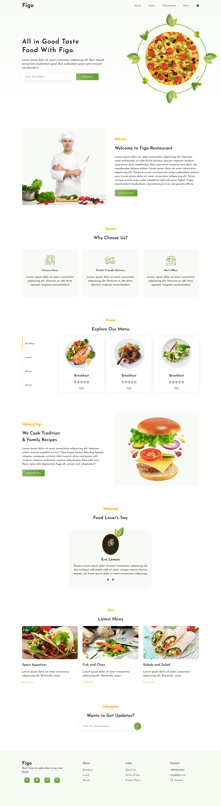
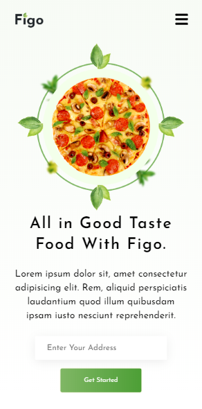
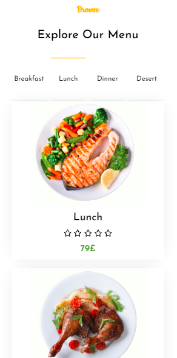

# Figo Restaurant

## Description:

Web design from <a href="dribbble.com">Dribblbe</a> translated into code.

## Tools & Languages:

- HTML5
- CSS3
- JavaScript ES6

## Screenshots:

### Desktop Size

### Mobile Size

### <a href="https://codedish.github.io/figo-restaurant/.">Live Demo</a>

## License

This project is open-source and under the <a href="https://opensource.org/licenses/MIT">MIT Licence</a>
